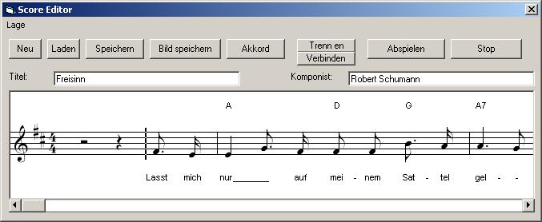



## Score Editor

### Description

This is a simple Score Editor in pure VB. You can create and edit Leadsheets with melody, songtext and chord-symbols.

At this time it's possible to use:

-notes and rests with different values (whole, half, quarter, 8th and 16th)

-dotted notes and triplets

-ties

-flat, sharp and natural keys

-different time signatures (4/4, 3/4, 2/4)

-different key signatures (only sharp)

-beams for 8th and 16th notes

-bar lines and repeat signs

It's also possible to play the leadsheet with MIDI and export it as a Bitmap file for printing (you can choose, how many bars are printed in one line).

IMPORTANT: The control is still under development and there are certainly some bugs and the code is very untidy.

Still to do for example:

-MIDI Im- and Export.

-Page break for Bitmap-Export

-Print function

-Automation for beams

-legato signs, and different dynamics and articulation marks

-flat key signatures

-maybe polyphony?

You can use it for whatever you want, but if you made a bigger modification, please send me a copy of your code to mp_cole@web.de.

Before using this code, you have to intall the true-type-font capella-invertiert.ttf on you PC. You can download it from: http://klausmeglitsch.heim.at/capella/userfiles/KlassischeFonts.zip.

Extract capella-ivertiert.ttf from the archive and put it in your font folder.

The MIDI-functions aren't from me but I cant't remember, where I've found them.

Sample-App and Comments are in German.
 
### More Info
 

             |
---                |---
**Submitted On**   |2007-04-16 12:09:20
**By**             |[MPCole](https://github.com/Planet-Source-Code/PSCIndex/blob/master/ByAuthor/mpcole.md)
**Level**          |Intermediate
**User Rating**    |4.7 (14 globes from 3 users)
**Compatibility**  |VB 6\.0
**Category**       |[Sound/MP3](https://github.com/Planet-Source-Code/PSCIndex/blob/master/ByCategory/sound-mp3__1-45.md)
**World**          |[Visual Basic](https://github.com/Planet-Source-Code/PSCIndex/blob/master/ByWorld/visual-basic.md)
**Archive File**   |[Score\_Edit2060794162007\.zip](https://github.com/Planet-Source-Code/mpcole-score-editor__1-68372/archive/master.zip)

